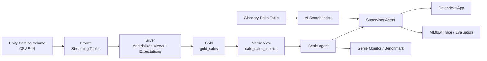
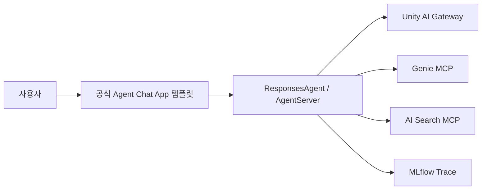

# Databricks 카페 End-to-End 핸즈온 설계

대상: Databricks 입문자  
방식: 코드 입력 없이 제공된 데이터·노트북·설정 파일을 실행하고 UI에서 구성  
권장 시간: 5시간 15분(휴식 포함), 또는 3시간 + 2시간 15분의 2개 세션

---

## 1. 최종 목표

이 핸즈온은 하나의 작은 카페 데이터셋을 끝까지 재사용한다.

1. Spark Declarative Pipelines(SDP) 코드로 Bronze–Silver–Gold를 선언한다.
2. Lakeflow Pipelines에서 DAG·증분 처리·Expectations를 확인한다.
3. Lakeflow Jobs로 파이프라인 실행과 검증을 오케스트레이션한다.
4. Gold 데이터를 Metric View로 표준화한다.
5. Genie Agent를 만들고 설명·동의어·예제 SQL·명확화 규칙으로 품질을 개선한다.
6. AI Search 용어집을 만들고 업무 용어와 다의어를 검색한다.
7. Supervisor Agent가 Genie와 AI Search를 선택적으로 호출하게 한다.
8. Databricks Apps에서 대화형 UI로 제공한다.
9. Genie Benchmark와 MLflow Trace·Scorer·피드백으로 품질을 측정한다.

SDP와 Lakeflow Pipelines는 별도의 두 ETL 제품으로 가르치지 않는다. SDP는 데이터셋을 선언하는 프레임워크이고, Lakeflow Pipelines는 그 선언을 Databricks에서 실행·운영하는 서비스다. Lakeflow Jobs는 파이프라인을 다른 태스크와 함께 오케스트레이션한다.



SFTP Export, 고객 예약 ML, 대규모 메타데이터 자동 생성, 거버넌스·대시보드 전체 구현은 이번 학습 목표와 직접 연결되지 않으므로 제외한다.

---

## 2. 최소 데이터 설계

### 2.1 원천 데이터는 재생성하지 않는다

원천 CSV는 카페 매장·상품·주문 분석에 필요한 최소 데이터로 구성한다.

| 파일 | 크기 | 역할 |
|---|---:|---|
| `stores.csv` | 3행 | 강남점·판교점·해운대점 매장 마스터 |
| `products.csv` | 8행 | 커피·음료·푸드·디저트 상품 마스터 |
| `orders_batch_001.csv` | 100행 | 첫 증분 배치 |
| `orders_batch_002.csv` | 100행 | 두 번째 증분 배치 |
| `orders_batch_003.csv` | 100행 | 세 번째 증분 배치와 배치 간 중복 |

분석 기간은 2026-07-01부터 2026-07-14까지다.

### 2.2 의도적 데이터 품질 이슈

| 이슈 | 원천 개수 | Silver 처리 |
|---|---:|---|
| 배치 간 중복 주문 | 2 | `order_id` 기준 첫 행 유지 |
| 0 이하 수량 | 2 | Expectation으로 DROP |
| NULL 할인율 | 5 | 0으로 표준화 |
| 소문자 상태값 | 7 | `UPPER(status)`로 표준화 |
| 취소 주문 | 30 | Silver에는 유지, Gold 매출에서는 제외 |

최종 기대 행 수는 다음과 같다.

| 계층 | 기대 행 수 | 의미 |
|---|---:|---|
| Bronze Orders | 300 | 원천을 그대로 보존 |
| 고유 주문 ID | 298 | 중복 2건 제거 |
| Silver Orders | 296 | 중복과 잘못된 수량 제거 |
| Gold Sales | 266 | 유효한 완료 주문만 포함 |

### 2.3 Gold 데이터 그레인

`gold_sales`는 완료 주문 한 건당 한 행이다. 현재 샘플은 주문 한 건이 상품 한 종류를 나타내므로 별도 주문 헤더/라인 테이블을 만들지 않는다.

주요 파생 컬럼은 다음과 같다.

| 컬럼 | 정의 |
|---|---|
| `order_date` | 주문일 |
| `day_name` | 한글 요일 |
| `day_type` | 토·일은 주말, 나머지는 평일 |
| `daypart` | 모닝 06~10, 점심 11~13, 오후 14~17, 저녁 18~21, 야간 22~05 |
| `gross_sales` | `quantity × unit_price` |
| `discount_amount` | `gross_sales × discount_pct / 100` |
| `net_sales` | `gross_sales - discount_amount` |

### 2.4 검증 기대값

| 지표 | 기대값 |
|---|---:|
| 총매출 | 1,772,800원 |
| 할인액 | 38,220원 |
| 순매출 | 1,734,580원 |
| 주문수 | 266건 |
| 판매수량 | 356개 |
| 객단가 | 6,520.98원/건 |

매장별 순매출 기대값은 판교점 647,460원, 강남점 573,500원, 해운대점 513,620원이다.

### 2.5 새로 추가한 지원 데이터

| 파일 | 행 수 | 용도 |
|---|---:|---|
| `sample_data/support/glossary.csv` | 19 | AI Search 용어집 |
| `genie_example_queries.csv` | 6 | 검증된 Genie 예제 SQL |
| `genie_benchmarks.csv` | 12 | Chat 8개 + Agent 4개 벤치마크 |
| `agent_evaluation.csv` | 10 | Supervisor Tool routing 평가 |
| `data_dictionary.csv` | 32 | 계층별 컬럼·품질 규칙 설명 |
| `expected_results.csv` | 15 | 파이프라인·지표 정답 확인 |

고객 테이블은 추가하지 않는다. `손님수`를 의도적으로 지원하지 않음으로 두어, Agent가 데이터 범위를 설명하고 `주문수` 또는 `판매수량`을 되묻는 실습에 사용한다.

---

## 3. 사용자 요구사항별 구체 매핑

| 단계 | 참가자가 하는 일 | 제공 자산 | 완료 결과 |
|---|---|---|---|
| 1. Data Engineering | Volume 업로드, Pipeline 생성, Job 실행, DAG·Expectation 확인 | `00_setup.sql`, `01_cafe_medallion_pipeline.sql`, Bundle YAML | Bronze 3개, Silver 3개, Gold 1개 |
| 2. Metric View | 기준선 생성, 필드·측정값 확인, 최적화 정의 적용 | `02_metric_view_baseline.sql`, `03_metric_view_optimized.sql` | `cafe_sales_metrics` |
| 3. Genie Agent | Metric View 연결, 질문·예제·지침 입력, 전후 Benchmark 실행 | `genie_questions.md`, `genie_instructions.md`, 예제/벤치마크 CSV | 품질 개선 전후 점수 |
| 4. AI Search | 용어집 Delta 테이블과 Delta Sync Index 생성, Hybrid 검색 | `05_create_ai_search.py`, `glossary.csv` | `cafe_glossary_index` |
| 5. AI Agent | Supervisor에 Genie와 AI Search를 Tool로 연결, 라우팅 시험 | `supervisor_prompt.md`, Agent 평가 CSV | 표준/용어/명확화 3개 경로 |
| 6. Databricks Apps | Agent App 템플릿 설치, 리소스 바인딩, App 실행 | `app_resource_binding.example.yml`, `app.yaml.example` | 대화형 카페 분석 App |
| 7. MLflow | Trace 확인, Scorer 평가, 사용자 피드백 확인 | `06_mlflow_monitoring.py`, Agent 평가 CSV | Trace·평가 결과·모니터링 |

---

## 4. 단계별 실습 설계

## 4.1 Data Engineering: SDP + Lakeflow Pipelines + Lakeflow Jobs

### 학습 포인트

- SDP의 선언적 데이터셋 정의
- Streaming Table과 Materialized View의 차이
- Auto Loader 기반 파일 증분 적재
- Bronze 원본 보존, Silver 표준화, Gold 비즈니스 모델링
- Expectations의 관찰·DROP 동작
- Pipeline이 만드는 DAG와 Job이 만드는 오케스트레이션 DAG의 차이

### 참가자 실습

1. `00_setup.sql`을 Run all 한다.
2. Volume에 매장·상품·`orders_batch_001.csv`만 먼저 업로드한다.
3. 제공된 `01_cafe_medallion_pipeline.sql`을 소스로 ETL Pipeline을 만든다.
4. 첫 Update를 실행하고 Bronze–Silver–Gold DAG를 확인한다.
5. 나머지 주문 배치 2개를 업로드하고 Update를 다시 실행한다.
6. Bronze가 새 파일만 증분 처리하는 것을 확인한다.
7. Data quality 화면에서 잘못된 수량이 DROP된 것을 확인한다.
8. `cafe_medallion_job`을 Run now 하고 Pipeline → Validation 태스크 의존성을 확인한다.

### 완료 기준

- Bronze 300행, Silver 296행, Gold 266행
- Job의 두 태스크가 모두 성공
- Pipeline Event Log와 Expectation 지표를 찾을 수 있음

---

## 4.2 Metric View

### 학습 포인트

- Metric View가 Gold 테이블 위의 재사용 가능한 의미 계층이라는 점
- Field/Dimension과 Measure의 차이
- 매출·주문수·판매수량·객단가의 중앙 정의
- Display name, Comment, Synonym, Format이 Genie 정확도에 주는 영향

### 참가자 실습

1. `02_metric_view_baseline.sql`을 실행한다.
2. Catalog Explorer에서 Metric View를 열고 Fields와 Measures를 확인한다.
3. 다음 쿼리 결과를 확인한다.
   - 전체 순매출
   - 매장별 순매출
   - 상품별 판매수량
4. Genie 기준선 Benchmark를 실행한다.
5. `03_metric_view_optimized.sql`을 실행한다.
6. 추가된 한글 표시명·설명·동의어·포맷을 확인한다.
7. 동일 Benchmark를 다시 실행한다.

### 최적화 실습을 두 종류로 구분한다

**의미/정확도 최적화**

- 필요한 필드만 노출
- 명확한 Description
- 업무 동의어
- 지표별 표시 포맷
- 예제 SQL
- 짧고 구체적인 명확화 지침

**물리/쿼리 성능 최적화**

- Gold에 `CLUSTER BY AUTO`
- Metric View에 일·매장·카테고리 Materialization
- Serverless SQL Warehouse 사용
- Materialization refresh를 원천 Pipeline 이후로 정렬

샘플이 300행뿐이므로 물리 성능 차이는 측정 대상으로 삼지 않는다. Query Profile과 Materialization 구조를 확인하는 개념 실습으로 제한하고, 핵심 비교 지표는 Genie Benchmark 정확도와 SQL 일관성으로 둔다.

---

## 4.3 Genie Agent 생성·연동·최적화

### 초기 구성

- 목적: 카페 운영 담당자의 매장·상품·시간대별 완료 주문 매출 분석
- 데이터 자산: `cafe_training.cafe_hands_on.cafe_sales_metrics` 하나만 연결
- SQL Warehouse: Serverless 권장
- 공통 질문: 기본 5개 + 분석형 5개

Databricks 권장사항에 맞춰 처음에는 1개 Metric View만 연결한다. 공식 가이드는 Agent를 작게 시작하고, 필요한 테이블을 5개 이하로 집중하며, 컬럼 설명·동의어·예제 SQL을 우선 사용하라고 권장한다.

### 품질 개선 순서

1. **기준선**: Metric View만 연결하고 12개 Benchmark 실행
2. **Metadata**: 표시명·설명·동의어 추가
3. **예제 SQL**: 검증된 6개 예제 추가
4. **짧은 지침**: 매출 기본값, 최근 기간, 명확화 규칙만 추가
5. **재평가**: 동일 Benchmark 재실행
6. **오류 수정**: 생성 SQL 검토 → 올바른 SQL로 수정 → Add as instruction

### 벤치마크 구성

| 모드 | 개수 | 평가 방식 |
|---|---:|---|
| Chat | 8 | 제공 SQL의 결과셋과 Genie 결과셋 비교 |
| Agent | 4 | LLM Judge가 Evaluation note 기준으로 평가 |

Chat Benchmark는 전체 순매출, 매장별 순매출, TOP3 상품, 카테고리, 날짜, 시간대, 객단가, 주말/평일을 다룬다.

Agent Benchmark는 다음 행동을 평가한다.

- `인기메뉴`: 매출/판매수량 기준을 되묻기
- `손님수`: 데이터 부재를 설명하고 대체 지표 되묻기
- `라떼`: 카페라떼/바닐라라떼를 되묻기
- `최근`: 데이터 최대일 기준 7일을 적용하고 실제 기간 밝히기

### 모니터링 실습

1. Monitor 탭에서 질문·응답·평점·상태로 필터링한다.
2. 틀린 질문 하나를 `Fix it` 또는 `Request review`로 표시한다.
3. 생성 SQL을 열어 오류를 확인한다.
4. 수정된 SQL을 Example instruction으로 저장한다.
5. 해당 Benchmark만 재실행한다.
6. Weekly digest에서 메시지 수·활성 사용자·좋아요/싫어요를 확인한다.

### 완료 기준

- Chat 8개에 모두 SQL Answer가 등록됨
- Agent 4개에 Evaluation note가 등록됨
- 기준선과 최적화 후 Accuracy를 기록함
- 명확화 질문 3개가 즉시 SQL을 실행하지 않음

---

## 4.4 AI Search 용어집

### 최소 구성

- 원천: `cafe_training.cafe_hands_on.cafe_glossary`
- 행 수: 19
- Primary key: `term_id`
- Embedding source: `search_text`
- Index: Triggered Delta Sync
- 검색: Hybrid, Top 3

Triggered Sync는 19행짜리 교육 데이터에 Continuous Sync 비용을 사용하지 않기 위한 선택이다.

### 용어 유형

| 유형 | 예시 | Agent 행동 |
|---|---|---|
| 지표 동의어 | 매출, 실매출, 객단가 | 표준 Metric으로 변환 |
| 상품 별칭 | 아메, 에이드 | 정식 상품명으로 변환 |
| 다의어 | 인기메뉴, 라떼 | 사용자에게 기준/상품 되묻기 |
| 미지원 개념 | 손님수 | 데이터 범위 설명 후 대체 지표 제안 |
| 시간 규칙 | 최근, 피크타임, 시간대 | 정의를 적용해 Genie 질의 구성 |

### 참가자 실습

1. `glossary.csv`를 Volume에 업로드한다.
2. `05_create_ai_search.py`를 실행한다.
3. Delta table, endpoint, index, Triggered sync 상태를 확인한다.
4. `아메 매출`, `피크타임`, `라떼 매출`로 Hybrid 검색한다.
5. Top 3 결과가 질문의 올바른 규칙을 포함하는지 확인한다.

### 완료 기준

- Index 상태 ONLINE
- `아메` 검색 결과에 `아메리카노` 포함
- `라떼` 검색 결과에 명확화 규칙 포함
- `손님수` 검색 결과에 미지원 및 대체 지표 규칙 포함

---

## 4.5 Supervisor AI Agent

### 역할 분리

| 질문 유형 | Tool 경로 | 예시 |
|---|---|---|
| 표준 정량 질문 | Genie | `매장별 순매출 알려줘` |
| 별칭/업무용어 | AI Search → Genie | `아메 매출 알려줘` |
| 명확화 필요 | AI Search → 사용자 질문 | `라떼 매출 알려줘` |
| 지원하지 않는 개념 | AI Search → 대체 지표 질문 | `손님이 가장 많은 매장은?` |

### 구성

- LLM: Unity AI Gateway 또는 워크스페이스에서 승인된 Foundation Model endpoint
- Tool 1: Genie Agent MCP
- Tool 2: AI Search MCP
- Prompt: `resources/supervisor_prompt.md`
- 평가셋: `sample_data/support/agent_evaluation.csv`

### 참가자 실습

1. Agent 템플릿에 Genie와 AI Search를 Tool로 등록한다.
2. 제공된 Supervisor Prompt를 적용한다.
3. 10개 평가 질문 중 4개를 직접 실행한다.
4. MLflow Trace에서 실제 Tool 호출 순서를 확인한다.

### 기초 세션에서 제외할 것

- 장기 메모리와 Lakebase
- 고객 프로필 저장
- 다수의 하위 Agent
- 직접 SQL 생성 Tool
- 복잡한 Human-in-the-loop 승인 플로우

Supervisor의 목적은 `Genie 단독 호출`, `용어집 후 Genie`, `명확화`의 세 경로만 이해하는 것이다.

---

## 4.6 Databricks Apps

롯데호텔 프로젝트와 같은 구조를 유지하되 프런트엔드 커스터마이징은 하지 않는다.



### 최소 리소스 바인딩

| 리소스 | 권한 | 환경 변수 |
|---|---|---|
| Genie Agent | `CAN_RUN` | `GENIE_SPACE_ID` |
| AI Search Index | `SELECT` | `VECTOR_SEARCH_INDEX` |
| MLflow Experiment | `CAN_MANAGE` | `MLFLOW_EXPERIMENT_ID` |
| AI Gateway/Model endpoint | 최소 Query 권한 | `AI_GATEWAY_MODEL` |

### 참가자 실습

1. 공식 Agent App 템플릿을 설치한다.
2. 기존 Supervisor Agent 코드를 배포한다.
3. Genie와 MLflow Experiment는 Bundle 예시를 사용하고, AI Search Index는 App UI에서 `cafe_glossary_index` 키와 `CAN SELECT` 권한으로 추가한다.
4. OBO 범위 `genie`, `vector-search`, `ai-gateway`를 확인한다.
5. 앱에서 표준 질문, 용어 질문, 명확화 질문을 각각 한 번 실행한다.
6. 응답에 좋아요/싫어요를 남긴다.

### 운영 주의사항

- 리소스 ID를 코드에 하드코딩하지 않고 App Resource binding을 사용한다.
- `app.yaml.example`의 `valueFrom` 키와 App Resource 키가 정확히 일치해야 한다.
- 최소 권한을 사용한다.
- 사용자 질문 본문 전체를 App 로그에 출력하지 않는다.
- 기초 세션에서는 채팅 영속화를 사용하지 않는다. App 재시작 후 이력이 사라지는 점을 명시한다.
- App 배포 시간은 세션 일정에 반영한다.

---

## 4.7 MLflow 모니터링 및 벤치마킹

### Genie Benchmark와 MLflow Evaluation의 역할 구분

| 영역 | 무엇을 평가하는가 | 도구 |
|---|---|---|
| Genie SQL 정확도 | 질문 → SQL 결과셋 | Genie Benchmarks Chat mode |
| Genie 분석 응답 | 다단계 분석·명확화 | Genie Benchmarks Agent mode |
| Supervisor routing | Genie/AI Search 선택과 순서 | MLflow Trace + ToolCall scorer |
| 최종 답변 품질 | 관련성·안전성·정확성 | MLflow Scorers/LLM Judges |
| 실제 사용자 반응 | 좋아요/싫어요·리뷰 요청 | App Assessment + Genie Monitor |
| 운영 성능 | latency, error, token/cost | MLflow Trace |

### 최소 Scorer

- `RelevanceToQuery`
- `Safety`
- `ToolCallCorrectness`
- 코드 기반 `route_accuracy`는 심화 과제로 둔다.

### 참가자 실습

1. App에서 `agent_evaluation.csv`의 질문을 실행한다.
2. `06_mlflow_monitoring.py`로 최근 Trace를 조회한다.
3. 입력·출력·Genie/AI Search Tool span·latency를 확인한다.
4. 세 가지 기본 Scorer로 개발 평가를 실행한다.
5. 앱의 좋아요/싫어요가 Trace Assessment로 연결되는지 확인한다.
6. Production Monitoring Preview가 활성화되어 있으면 Safety scorer의 50% 샘플링을 확인한다.

### 운영 대시보드 최소 지표

| 지표 | 목표 예시 |
|---|---:|
| Genie Chat Benchmark Accuracy | 90% 이상 |
| 명확화 행동 정확도 | 3/3 |
| Supervisor Tool routing 정확도 | 90% 이상 |
| 오류 없는 응답 비율 | 95% 이상 |
| 좋아요 비율 | 80% 이상 |
| 응답 latency p95 | 워크스페이스 기준선 대비 관리 |

절대 latency 목표는 모델·Warehouse·리전·동시 사용자에 따라 달라지므로 고정 SLA를 설정하지 않는다. 첫 실행의 cold start와 이후 실행을 구분해서 관찰한다.

---

## 5. 권장 시간표

| 시간 | 세션 | 결과물 |
|---:|---|---|
| 15분 | 목표·아키텍처·데이터 소개 | 전체 흐름 이해 |
| 55분 | SDP + Lakeflow Pipeline + Job | Bronze/Silver/Gold |
| 30분 | Metric View | 기준선 의미 계층 |
| 65분 | Genie 생성·예제·지침·Benchmark | 기준선/개선 점수 |
| 15분 | 휴식 |  |
| 25분 | AI Search 용어집 | 검색 Index |
| 35분 | Supervisor Agent | Tool routing |
| 30분 | Databricks Apps | 대화형 App |
| 35분 | MLflow Trace·평가·피드백 | 평가 결과 |
| 10분 | 회고와 다음 단계 | 개선 Backlog |

총 5시간 15분이다.

3시간 기초 세션만 운영한다면 Data Engineering, Metric View, Genie까지만 진행한다. AI Search, Supervisor, Apps, MLflow는 2시간 15분 심화 세션으로 분리한다.

---

## 6. 실행 전 확인

### 워크스페이스 기능

- Unity Catalog 사용 가능
- Serverless Lakeflow Pipeline 사용 가능
- Serverless SQL Warehouse 사용 가능
- Metric View에 필요한 Runtime/SQL Warehouse 버전 확인
- Genie Agent 사용 가능
- AI Search와 embedding model 사용 가능
- Databricks Apps 사용 가능
- MLflow 3 사용 가능
- 선택 기능인 Production Monitoring과 대화 공유 Preview 활성화 여부 확인

### 권한

- `USE CATALOG`, `USE SCHEMA`, `CREATE TABLE`, `CREATE VOLUME`
- Gold/Metric View에 대한 `SELECT`
- Genie Agent `CAN EDIT` 또는 `CAN MANAGE`
- App에서 Genie `CAN_RUN`
- AI Search endpoint/index 생성 권한
- MLflow Experiment 편집 권한

### 실행 전 확인

1. 개인 Workspace에서 기본 Catalog `cafe_training`을 사용한다. 해당 Catalog를 만들 권한이 없으면 Catalog 관리자에게 생성을 요청한다.
2. 원천 CSV와 지원 CSV를 Volume에 업로드한다.
3. Pipeline을 미리 한 번 Validate한다.
4. AI Search endpoint의 embedding model 접근을 확인한다.
5. App 템플릿을 배포해 cold build 시간을 확인한다.
6. `04_validate.sql`의 모든 기대값이 맞는지 확인한다.
7. Genie Benchmark 실행에 사용할 Agent와 평가 질문을 확인한다.

---

## 7. 참가자에게 제공할 파일

```text
databricks_cafe_hands_on/
├─ sample_data/
│  ├─ raw/
│  │  ├─ stores.csv
│  │  ├─ products.csv
│  │  └─ orders/orders_batch_001~003.csv
│  └─ support/
│     ├─ glossary.csv
│     ├─ genie_example_queries.csv
│     ├─ genie_benchmarks.csv
│     ├─ agent_evaluation.csv
│     ├─ data_dictionary.csv
│     └─ expected_results.csv
├─ notebooks/
│  ├─ 00_setup.sql
│  ├─ 01_cafe_medallion_pipeline.sql
│  ├─ 02_metric_view_baseline.sql
│  ├─ 03_metric_view_optimized.sql
│  ├─ 04_pipeline_validate.sql
│  ├─ 04_validate.sql
│  ├─ 05_create_ai_search.py
│  └─ 06_mlflow_monitoring.py
├─ resources/
│  ├─ cafe_hands_on.resources.yml
│  ├─ cafe_sales_metrics.optimized.yml
│  ├─ genie_instructions.md
│  ├─ genie_questions.md
│  ├─ supervisor_prompt.md
│  └─ app_resource_binding.example.yml
├─ cafe_sample_data_review.xlsx
├─ cafe_hands_on_assets.xlsx
├─ databricks.yml
├─ README.md
├─ docs/00_start_here.md
└─ docs/00_github_publish.md
```

CSV는 Databricks 업로드용이고, XLSX는 데이터·정답·평가셋 검토용이다.

---

## 8. 의도적으로 제외한 복잡도

- 고객·멤버십·재고·날씨 데이터
- 여러 Gold Fact와 다수 Metric View
- CDC/SCD Type 2
- Continuous Pipeline
- 복잡한 Window Measure
- Agent 장기 메모리와 Lakebase
- 커스텀 React UI 개발
- 여러 Supervisor 하위 Agent
- 운영용 대규모 부하 테스트

이 항목들은 기초 학습 목표를 흐리므로 후속 세션으로 분리한다.

---

## 9. 성공 기준

세션이 끝났을 때 참가자는 다음을 설명하거나 보여줄 수 있어야 한다.

- Bronze–Silver–Gold에서 각 계층이 담당하는 역할
- Pipeline DAG와 Job DAG의 차이
- Expectation이 제거한 잘못된 행
- Metric View에서 Field와 Measure의 차이
- 설명·동의어·예제 SQL이 Genie 품질을 높이는 이유
- Chat Benchmark와 Agent Benchmark의 차이
- AI Search를 먼저 호출해야 하는 질문
- Supervisor가 명확화해야 하는 질문
- App Resource binding과 OBO가 필요한 이유
- MLflow Trace에서 Tool 호출과 latency를 확인하는 방법

---

## 10. Databricks 공식 참고 문서

- [Spark Declarative Pipelines](https://docs.databricks.com/aws/en/ldp)
- [Lakeflow Pipelines best practices](https://docs.databricks.com/aws/en/ldp/best-practices)
- [Pipeline expectations](https://docs.databricks.com/aws/en/ldp/expectations)
- [Lakeflow Jobs](https://docs.databricks.com/aws/en/jobs/)
- [Unity Catalog metric views](https://docs.databricks.com/aws/en/uc-semantics/metric-views/)
- [Create a metric view](https://docs.databricks.com/aws/en/uc-semantics/metric-views/create)
- [Agent metadata in metric views](https://docs.databricks.com/aws/en/uc-semantics/agent-metadata)
- [Metric view materialization](https://docs.databricks.com/aws/en/uc-semantics/metric-views/materialization)
- [Curate an effective Genie Agent](https://docs.databricks.com/aws/en/genie-agents/best-practices)
- [Test and monitor a Genie Agent](https://docs.databricks.com/aws/en/genie-agents/monitor)
- [Create AI Search endpoints and indexes](https://docs.databricks.com/aws/en/ai-search/create-ai-search)
- [AI Search retrieval quality guide](https://docs.databricks.com/aws/en/ai-search/retrieval-quality)
- [Build a multi-agent system on Databricks Apps](https://docs.databricks.com/aws/en/agents/agent-framework/multi-agent-apps)
- [Add a Genie Agent resource to a Databricks app](https://docs.databricks.com/aws/en/dev-tools/databricks-apps/genie)
- [MLflow Tracing](https://docs.databricks.com/aws/en/mlflow3/genai/tracing/)
- [Evaluate and monitor agents](https://docs.databricks.com/aws/en/mlflow3/genai/eval-monitor)
